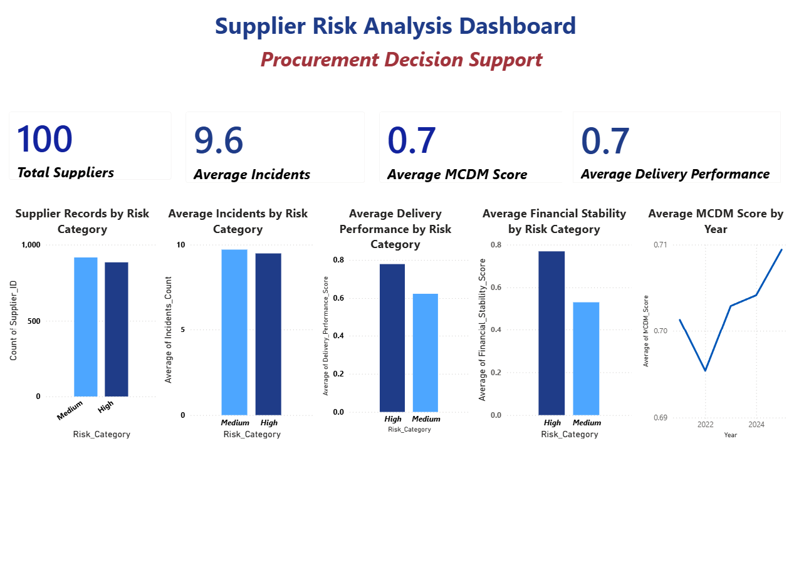

# Supplier-Risk-Analysis-for-Procurement-Decision-Support
Supplier risk analysis project using Python and Power BI for procurement decision support.

## Project Overview
This project analyzes supplier risk and performance data to support procurement decision-making. It focuses on supplier records, incident levels, delivery performance, financial stability, and MCDM score using Python and Power BI.

## Objectives
- Monitor supplier risk patterns
- Compare performance across risk categories
- Support procurement review and supplier monitoring
- Present insights through a dashboard

## Tools Used
- Python
- Pandas
- Matplotlib
- Power BI

## Key Metrics
- Total Suppliers
- Average Delivery Performance
- Average Incidents
- Average MCDM Score

## Dashboard Highlights
- Supplier Records by Risk Category
- Average Incidents by Risk Category
- Average Delivery Performance by Risk Category
- Average Financial Stability by Risk Category
- Average MCDM Score by Year

## Files in This Repository
- `supplier_risk_analysis.ipynb` – Python notebook for data cleaning, analysis, and visualization
- `supplier_risk.csv` – dataset used in the project
- `supplier_risk_dashboard.pbix` – Power BI dashboard file
- `dashboard_overview.png` – dashboard preview image

## Dashboard Preview

## Key Insights
- High-risk records tend to show weaker delivery performance
- Incident levels remain high across risk categories
- Financial stability differs between risk groups
- Dashboard reporting can support procurement review and supplier monitoring

## Project Relevance
This project is relevant to procurement and supply chain roles because it supports supplier monitoring, risk awareness, and decision-making using data analysis and dashboard reporting.
